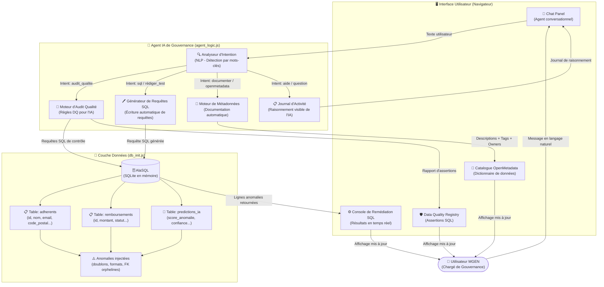
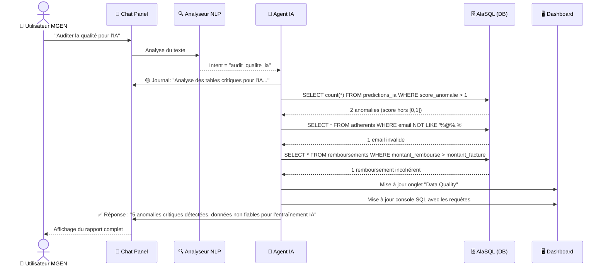
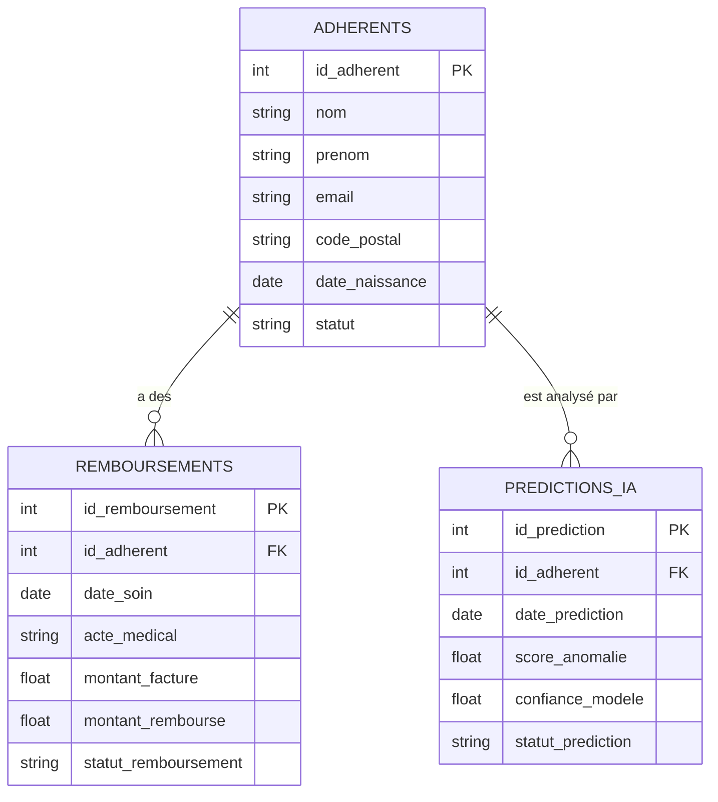
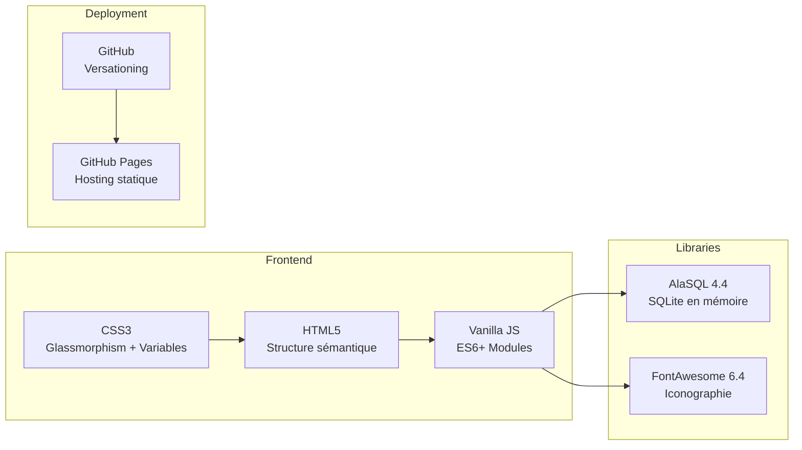

# 🧠 Architecture Technique — Agent IA de Gouvernance MGEN

> Ce document décrit l'architecture interne du **MGEN Governance Steward**, un agent IA conversationnel de gouvernance et qualité des données. Il a été conçu pour démontrer une maîtrise des concepts clés du poste : dictionnaire de données (OpenMetadata), qualité des données pour l'IA (Data-Centric AI), et assistance fonctionnelle aux utilisateurs.

---

## 1. Vue d'ensemble — Architecture Générale

---

## 2. Pipeline de Traitement d'une Requête

---

## 3. Classification des Intentions (NLP)

L'agent utilise une détection par mots-clés pondérés pour classifier les intentions. Voici la matrice complète :

| Intention détectée | Mots-clés déclencheurs | Action de l'Agent |
|---|---|---|
| `audit_qualite_ia` | "audit", "qualité", "ia", "golden", "anomalie" | Lance `auditQualityForAI()` sur les 3 tables |
| `documenter_table` | "documente", "documentation", "décris", "décrit" | Injecte descriptions + tags dans le catalogue |
| `aide_openmetadata` | "openmetadata", "aide", "comment", "tutoriel" | Retourne une fiche d'aide interactive |
| `rédiger_sql` | "sql", "requête", "trouve", "cherche", "filtre" | Génère + exécute une requête SQL ciblée |
| `corriger_anomalies` | "corrige", "nettoie", "répare", "fix" | Exécute les requêtes `DELETE`/`UPDATE` de remédiation |
| `general` | *(par défaut)* | Réponse générale sur la gouvernance |

---

## 4. Modèle de Données (Tables en Mémoire AlaSQL)

---

## 5. Anomalies de Qualité Injectées (Golden Data Testing)

Le jeu de données simule des problèmes réels rencontrés en production :

| Table | Anomalie | Type DQ | Impact IA |
|---|---|---|---|
| `adherents` | Doublon id_adherent=1007 | Unicité | Biais d'entraînement |
| `adherents` | Email "jean.martin[at]gmail" | Format | Enrichissement impossible |
| `adherents` | Code postal "750" (3 chiffres) | Cohérence | Feature engineering cassé |
| `remboursements` | Montant remboursé > facturé | Cohérence métier | Faux positif modèle fraude |
| `remboursements` | Montant = -50€ | Plausibilité | Outlier toxique |
| `remboursements` | id_adherent=9999 inexistant | Intégrité référentielle | Jointure silencieuse |
| `predictions_ia` | score_anomalie = 1.45 (> 1.0) | Domaine de valeur | Erreur de normalisation |
| `predictions_ia` | confiance_modele = NULL | Complétude | Prédiction non fiable |

---

## 6. Stack Technologique

> **Zéro dépendance serveur** — 100% client-side. Fonctionne hors-ligne une fois chargé.

---

## 7. Alignement avec le Poste MGEN

| Mission du Poste | Fonctionnalité dans l'Agent |
|---|---|
| Enrichissement du dictionnaire OpenMetadata | Commande "Documente la table X" → injection auto de métadonnées |
| Formation & assistance utilisateurs | Section "Aide OpenMetadata" avec fiches explicatives interactives |
| Data Quality for AI (Golden Data) | Moteur d'audit complet sur les 3 tables avec rapport HTML détaillé |
| Identification des anomalies pour l'IA | Détection de 8 types d'anomalies, impact IA documenté par anomalie |
| Rédaction de tests SQL | Commande "Rédige un test SQL" → génération + exécution instantanée |
