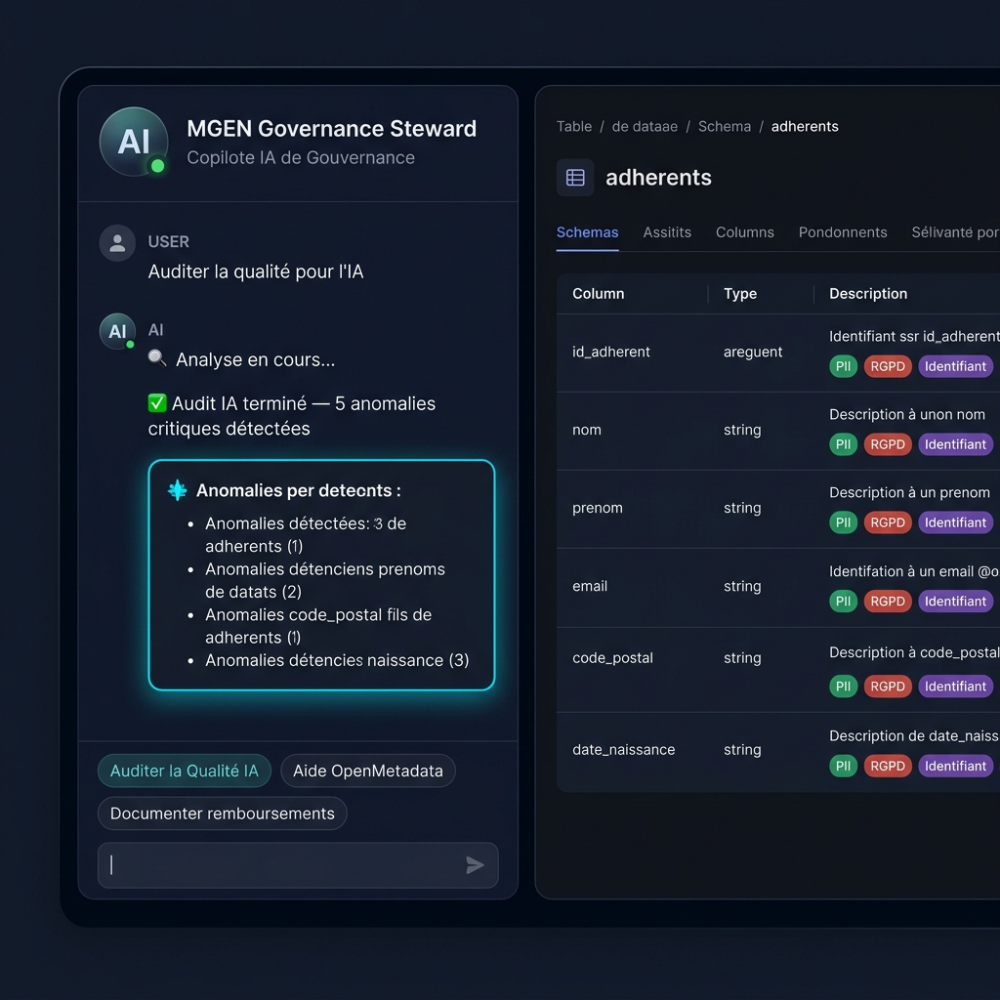
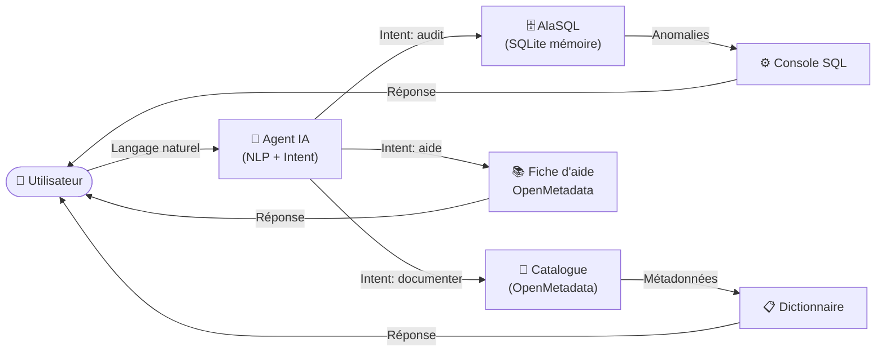

# 🤖 MGEN — Steward IA de Gouvernance & Qualité de Données

> Projet réalisé dans le cadre de ma candidature au poste de **Chargé(e) de Gouvernance et Qualité des Données en alternance** à la **MGEN**.

Application web professionnelle intégrant un **Agent IA conversationnel (Chatbot Copilot)** pour automatiser les tâches quotidiennes de gouvernance de données : documentation OpenMetadata, assertions SQL de qualité, et diagnostic d'anomalies sur les données critiques alimentant les algorithmes d'Intelligence Artificielle (*Data-Centric AI*).

---

## 📸 Aperçu Visuel

<div align="center">

### Interface Principale — Agent Chat & Catalogue de Données



*L'agent répond en langage naturel et met à jour le tableau de bord en temps réel*

</div>

---

## 🧠 Architecture Technique

→ **[Voir le document d'architecture complet](./ARCHITECTURE.md)** ← diagrammes Mermaid, pipeline, modèle de données



---

## 🎯 Alignement avec les Missions du Poste MGEN

| Mission | Commande dans l'Agent | Résultat |
|---|---|---|
| 📖 **Dictionnaire OpenMetadata** | `"Documente la table remboursements"` | Injection auto de descriptions, tags RGPD, Data Owner |
| 🎓 **Formation utilisateurs** | `"Aide OpenMetadata"` | Fiche interactive : tags, glossaires, data owners |
| 🛡️ **Data Quality for AI** | `"Auditer la qualité pour l'IA"` | Rapport complet : 8 anomalies détectées sur 3 tables |
| 🔍 **Identification anomalies** | `"Corrige les anomalies"` | SQL de remédiation généré et exécuté |
| 💻 **Tests SQL** | `"Rédige un test SQL"` | Requête générée + exécutée + résultats affichés |

---

## 🛠️ Stack Technologique

| Technologie | Rôle |
|---|---|
| **HTML5 / CSS3** | Interface glassmorphism, thème sombre professionnel |
| **Vanilla JS (ES6+)** | Logique agent, NLP, manipulation DOM |
| **AlaSQL 4.4** | Moteur SQL SQLite dans le navigateur (zéro backend) |
| **FontAwesome 6.4** | Iconographie moderne |
| **GitHub Pages** | Hébergement statique, zéro serveur |

---

## 🚨 Données de Test — Anomalies Injectées

Le jeu de données simule des cas réels de mauvaise qualité impactant les modèles d'IA :

| Table | Anomalie | Impact IA |
|---|---|---|
| `adherents` | Doublon `id=1007` | Biais d'entraînement |
| `adherents` | Email format invalide | Enrichissement impossible |
| `remboursements` | Montant remboursé > facturé | Faux positif modèle fraude |
| `remboursements` | FK orpheline `id=9999` | Jointure silencieuse |
| `predictions_ia` | Score > 1.0 | Erreur de normalisation |
| `predictions_ia` | Confiance = NULL | Prédiction non fiable |

---

## 🚀 Lancer le Projet

```bash
# Ouvrez simplement index.html dans votre navigateur
# Aucun serveur, aucune installation requise
start index.html  # Windows
open index.html   # Mac/Linux
```

> L'application est 100% autonome : AlaSQL et FontAwesome se chargent via CDN.

---

## 🔗 Liens

- **GitHub Pages** : `https://jeoram.github.io/Agent_gourvernance-/`
- **Autre projet** : [MGEN Data Governance Portal](https://github.com/jeoram/mgen-data-governance-portal)
- **Profil GitHub** : [github.com/jeoram](https://github.com/jeoram)
