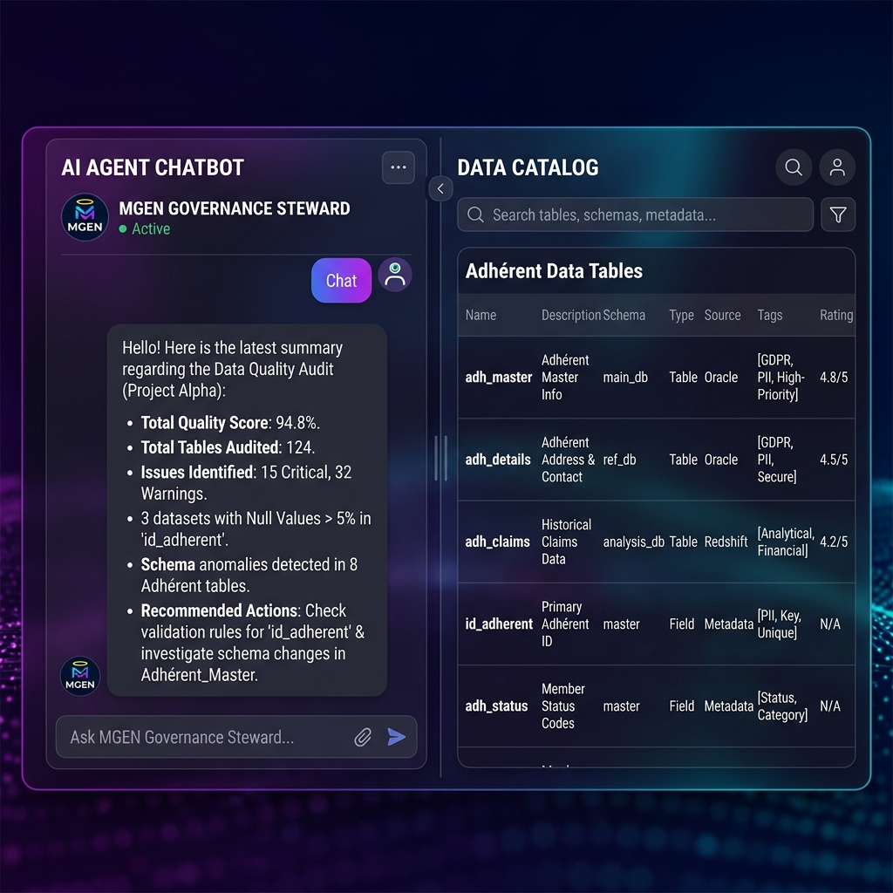
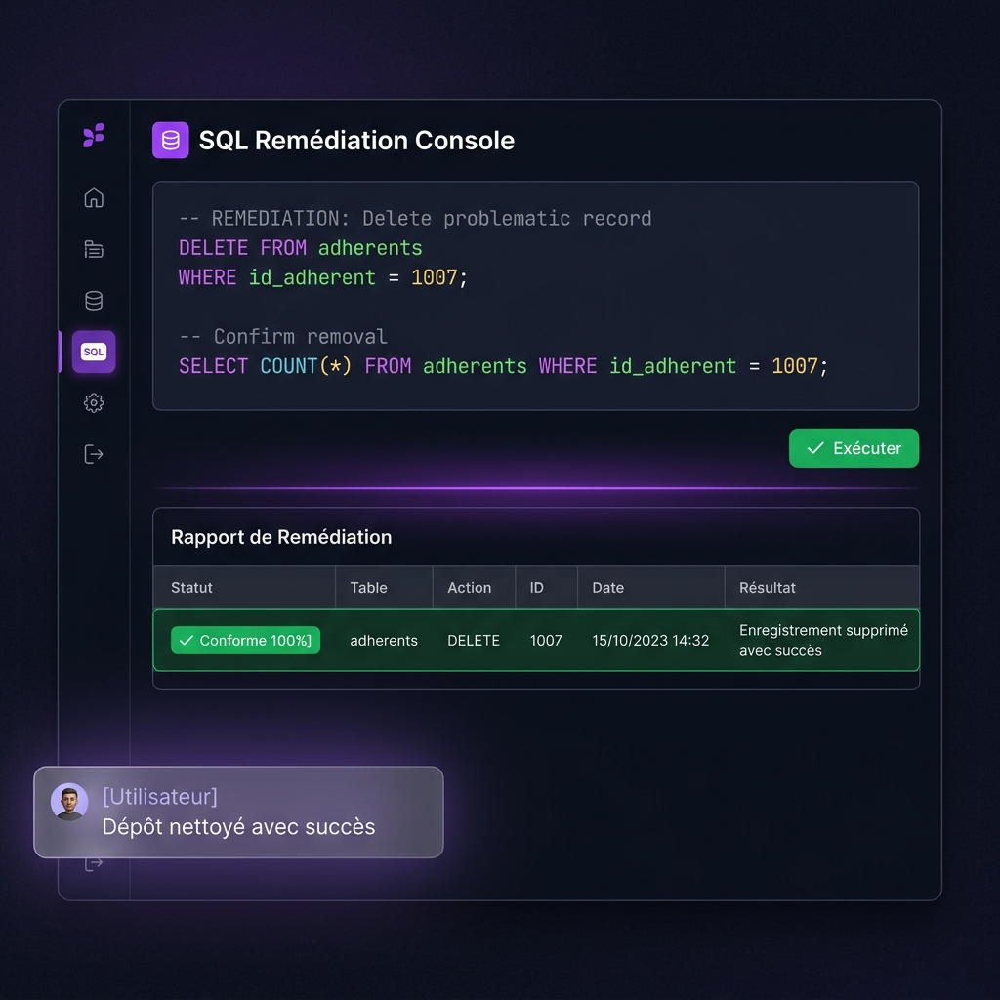
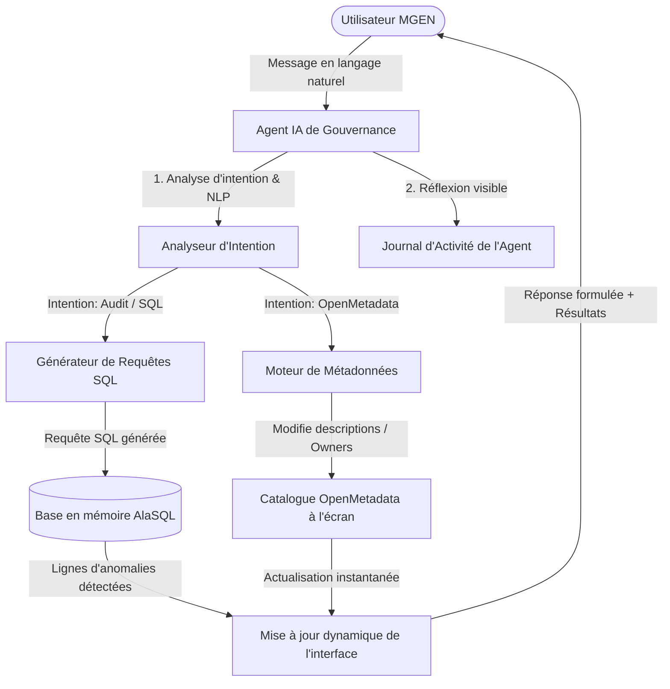

# MGEN - Steward IA de Gouvernance & Qualité de Données

Ce projet a été conçu dans le cadre de ma candidature pour le poste de **Chargé(e) de Gouvernance et Qualité des Données en alternance** à la **MGEN**.

Il s'agit d'une application de niveau professionnel qui intègre un **Agent IA conversationnel (Chatbot Copilot)** conçu pour aider les équipes métiers et techniques dans leurs tâches quotidiennes de gouvernance. L'agent interagit en langage naturel pour automatiser le dictionnaire de données (OpenMetadata), écrire des assertions SQL de qualité et diagnostiquer les anomalies sur les données critiques alimentant les algorithmes d'Intelligence Artificielle (*Data-Centric AI*).

---

## 📸 Aperçu Visuel du Portail

  <h3>Interface de Chat de l'Agent IA & Catalogue de Données</h3>
  
  
  <h3>Console de Remédiation SQL & Nettoyage de Base</h3>
  

---

## 🎯 Alignement avec les exigences du poste MGEN

Ce projet illustre une approche moderne de la gouvernance, propulsée par l'Intelligence Artificielle, répondant précisément à la fiche de poste :

1. **Mission Dictionnaire & Gouvernance (OpenMetadata)** :
   - Au lieu de documenter manuellement, l'utilisateur peut demander à l'agent : *"Documente la table remboursements"*.
   - L'agent génère instantanément des descriptions fonctionnelles appropriées, assigne les *Data Owners* et injecte les métadonnées directement dans le catalogue de droite.
2. **Data Quality for AI (Golden Data)** :
   - L'utilisateur peut demander : *"Fais un audit de la qualité pour l'IA"* ou *"Vérifie les données d'entrée de l'IA"*.
   - L'agent exécute en mémoire un ensemble de règles de qualité (unicité, format, cohérence) sur les données transactionnelles et d'identité, affiche un rapport d'audit détaillé et alerte sur les risques d'apprentissage biaisé pour les modèles d'IA.
3. **Accompagnement des Utilisateurs & SQL** :
   - L'agent offre une **assistance fonctionnelle interactive** sur l'utilisation d'OpenMetadata (ex. *"Comment ajouter un tag RGPD ?"* ou *"C'est quoi une Golden Data ?"*).
   - L'agent **génère et exécute lui-même du code SQL** de contrôle. Si vous lui demandez : *"Trouve les e-mails invalides"*, il écrit la requête SQL de sélection, l'exécute sur le moteur local et l'affiche sur l'interface de droite.

---

## 🧠 Architecture de l'Agent de Gouvernance

L'agent simule un processus de réflexion (*Thought process*) visible en direct par l'utilisateur (le "Journal d'activité"), permettant de comprendre comment l'IA formule ses requêtes SQL ou ses requêtes de métadonnées.

---

## 🛠️ Jeu de Données Factices & Anomalies

Pour tester l'agent, la base en mémoire contient des données de santé réalistes (advent, remboursements, prédictions d'anomalies de remboursements par un modèle d'apprentissage) avec des anomalies injectées exprès :
- **adherents** : Doublon d'adhérent (id: 1007), format d'e-mail incorrect, code postal trop court.
- **remboursements** : Remboursement supérieur au montant facturé, montant de remboursement négatif, clé étrangère orpheline (id_adherent inexistant).
- **predictions_ia** : Scores d'anomalie du modèle d'IA hors de l'intervalle `[0, 1]`, valeurs nulles inattendues.

*Vous pouvez demander à l'agent de nettoyer tout cela en lui envoyant : **"Corrige les anomalies"**.*

---

## 🚀 Lancement Local

1. Ouvrez simplement le fichier `index.html` dans votre navigateur (Chrome, Firefox, Safari ou Edge).
2. L'application est autonome : AlaSQL et FontAwesome se chargent via CDN. Aucune base de données ou serveur backend n'est requis.

---

## 🔗 Déploiement sur GitHub Pages

Pour que les recruteurs MGEN accèdent à votre projet en un clic :
1. Créez un nouveau dépôt public vide nommé `mgen-ai-governance-agent` sur votre profil GitHub.
2. Initialisez et poussez les fichiers locaux en exécutant le script `deploy.ps1` (sur Windows / PowerShell) ou `deploy.sh` (sur Bash).
3. Sur votre dépôt en ligne, allez dans **Settings** > **Pages**, choisissez la branche `main` et le dossier `/ (root)`, puis cliquez sur **Save**.
4. Le projet sera en ligne à l'adresse : `https://<votre-pseudo>.github.io/mgen-ai-governance-agent/`.
